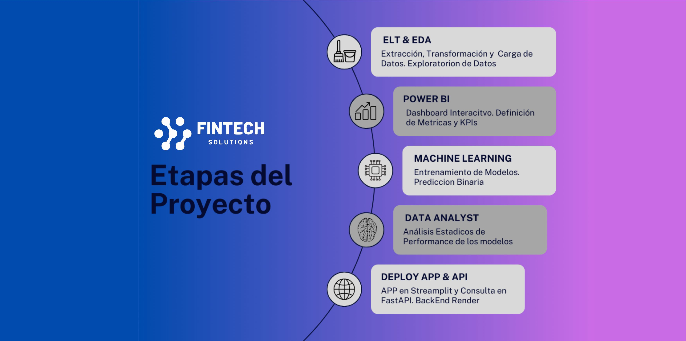
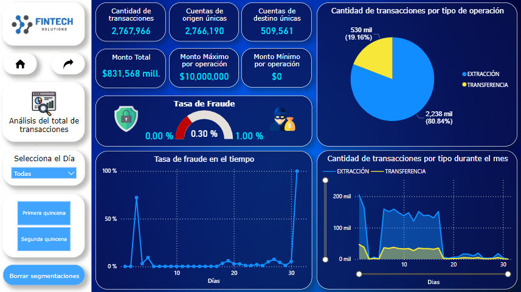
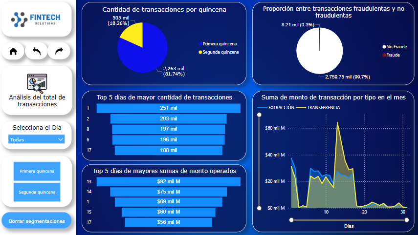
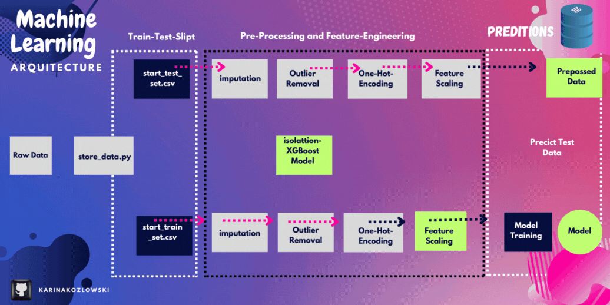
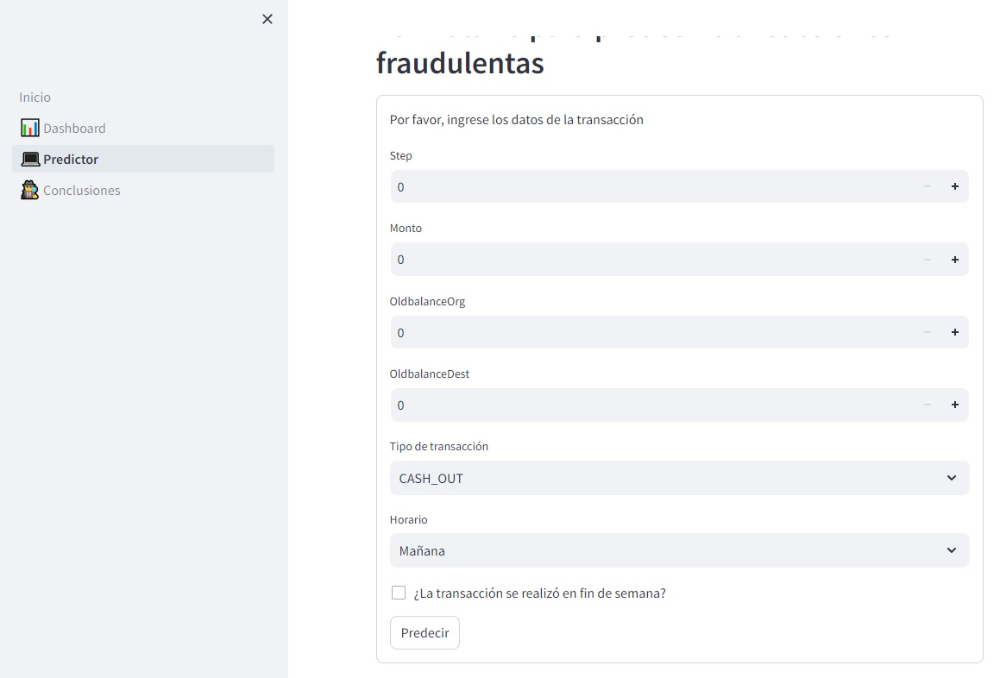

<!-- Proyecto Fintech -->
 
  

  

   

    
  

    

    
   
      

<h2> 
Introducción
</h2>

**Sistema de Predicción de Fraude en Transacciones Financieras:** Ofrecemos una solución práctica y simple para ayudar a identificar las transacciones fraudulentas y detectandolas con la mayor performance posible.

Desde la llegada de Internet, la revolución digital ha aumentado y se ha infiltrado en todos los aspectos de nuestras vidas. Una de las revoluciones digitales más importantes ocurrió en el sistema financiero y especialmente en las transacciones de dinero a alguien de cualquier parte del mundo de forma digital. Las transacciones digitales se han convertido en parte de la vida diaria, como comprar un producto en línea, enviar dinero a amigos, depositar efectivo en una cuenta bancaria, fines de inversión, etc. Tenían muchos beneficios y allanaron el camino para actividades fraudulentas. La gente comenzó a utilizar un medio de transacciones de dinero digital para lavar dinero y hacer que parezca que proviene de una fuente legal. 

 [Datos oficiales]()

## **Contexto**

 Un intento ilegal en este conjunto de datos es por ejemplo un intento de transferir más de 200.000 dolares en una sola transacción.

El fraude es un problema importante que afecta a toda la economía. Actualmente, faltan investigaciones públicas sobre la detección del fraude. Una razón importante es la falta de datos de transacciones, que a menudo son confidenciales.

Tambien es importante que las empresas financieras puedan reconocer transacciones fraudulentas para que a los clientes no se les cobre por artículos que no compraron. En esta tarea implementaremos la detección de anomalías para detectar si hay alguna transacción fraudulenta.

**Detección de valores atípicos**
La detección de valores atípicos, también conocida como detección de anomalías, es un paso en la minería de datos que identifica puntos de datos, eventos y/u observaciones que se desvían del comportamiento normal de un conjunto de datos.

## **Objetivo:** 🎯

El objetivo de este cuaderno es encontrar los patrones de transacciones realizadas y ayudar a los algoritmos a aprender esos patrones para identificar las transacciones fraudulentas y marcarlas con la mayor precisión posible. Compara diferentes modelos según su rendimiento

Detección de fraude en transacciones de dinero móvil. Predecir si la transacción es fraudulenta o no es un problema de clasificación. En este caso se trata de una clasificación binaria.

📌Objetivos:

+ Análisis exploratorio de datos para extraer el patrón de actividades fraudulentas.
+ Construir un modelo de aprendizaje automático para clasificar transacciones fraudulentas y no fraudulentas.
+ Reducir los falsos negativos ajustando el modelo.

  

## **Tecnologías Utilizadas**

+ Python
+ Jupyter Notebooks
+ Power BI
+ Pandas
+ NumPy
+ Matplotlib
+ Seaborn
+ Scikit-Learn

## **Desarrollo**

 
 
 

+ `Proceso de ETL (Extracción, transformación y carga de datos)` 

+ `Proceso de EDA (Análisis Exploratorio de los datos)`  [EDA](EDA/EDA.ipynb)

Las primeras visualizaciones contienen el número de transacciones según el tipo de transacción, tipo de remitente y destinatario.

Tipo de transacción más común utilizado para transacciones = 
Tipo de transacción menos común utilizado para transacciones = 
La mayoría de las transacciones realizadas fueron 

Hay 2 indicadores que me llaman la atención y es interesante observar: la columna isFraud y isFlaggedFraud. Según la hipótesis, isFraud es el indicador que indica las transacciones fraudulentas reales, mientras que isFlaggedFraud es lo que el sistema evita la transacción debido a que se activan algunos umbrales. En el mapa de calor anterior podemos ver que existe alguna relación entre otras columnas e isFlaggedFraud, por lo que debe haber una relación entre isFraud.

El sistema actual permite que las transacciones fraudulentas pasen a través de un sistema que no las etiqueta como fraude. Un poco de exploración de datos puede resultar útil para comprobar la relación entre las características.

**Cosas que podemos concluir de este mapa de calor:**

+ OldbalanceOrg y NewbalanceOrg están altamente correlacionados.
+ OldbalanceDest y NewbalanceDest están altamente correlacionados.
+ El monto está correlacionado con isFraud (variable objetivo).
+ No hay mucha relación entre las características, por lo que debemos comprender dónde depende la relación entre ellas según el tipo de transacción y el monto. Para hacerlo, necesitamos ver el mapa de calor de las transacciones fraudulentas y no fraudulentas de manera diferente.

**Deteccion de outliers:**

Un valor atípico es una observación que está numéricamente distante del resto de los datos o, en una palabra simple, es el valor que está fuera del rango. Tomemos un ejemplo para comprobar qué sucede con un conjunto de datos con y sin valores atípicos.

Los valores atípicos pueden ser de dos tipos: univariados y multivariados. Arriba, hemos discutido el ejemplo del valor atípico univariado. Estos valores atípicos se pueden encontrar cuando observamos la distribución de una sola variable. Los valores atípicos multivariados son valores atípicos en un espacio n-dimensional.

**Metodos:**

1. *Hypothesis Testing*

2. *Z-score method*

3. *Robust Z-score*

4. *I.Q.R method*

5. *Winsorization method(Percentile Capping)*

6. *DBSCAN Clustering*

7. *Isolation Forest*

8. *Visualizing the data*

+ `Modelado de Machine Learning` 

  
En la detección de fraudes financieros, se utilizan diversos modelos de aprendizaje automático para identificar patrones y anomalías en grandes conjuntos de datos. Algunos de los modelos más aplicados son:

1. *Regresión Logística:*
   - La regresión logística se utiliza para problemas de clasificación binaria y es común en la detección de fraudes, donde se busca predecir si una transacción es fraudulenta o legítima.

2. *Árboles de Decisión y Bosques Aleatorios:*
   - Los árboles de decisión y los bosques aleatorios son modelos que pueden capturar relaciones no lineales en los datos. Se utilizan para detectar patrones complejos que podrían indicar actividades fraudulentas.

3. *Máquinas de Vectores de Soporte (SVM):*
   - Las SVM son eficaces en la identificación de patrones en datos de alta dimensionalidad. Se aplican en la detección de fraudes, especialmente cuando los datos pueden ser separados de manera no lineal.

4. *Redes Neuronales:*
   - Las redes neuronales, especialmente las redes neuronales profundas, son modelos poderosos que pueden aprender representaciones complejas de los datos. Se aplican en la detección de fraudes para identificar patrones sutiles y características no lineales.

5. *Aprendizaje No Supervisado (Clustering):*
   - Algoritmos de clustering como el k-means o el DBSCAN pueden agrupar transacciones similares y resaltar anomalías que podrían indicar fraudes.

6. *Análisis de Series Temporales:*
   - Para la detección de fraudes en transacciones temporales, se utilizan modelos especializados en el análisis de series temporales, como los modelos ARIMA (AutoRegressive Integrated Moving Average) o LSTM (Long Short-Term Memory) en redes neuronales recurrentes.

7. *Enfoques basados en Reglas y Heurísticas:*
   - Además de los modelos de aprendizaje automático, se utilizan enfoques basados en reglas y heurísticas para establecer criterios específicos que puedan indicar la presencia de fraudes.

8. *Aprendizaje Semisupervisado y Reforzado:*
   - Estos enfoques pueden ser útiles cuando hay pocos datos etiquetados. Se pueden entrenar modelos inicialmente con datos no etiquetados y luego refinarlos con retroalimentación basada en la supervisión o en el rendimiento del sistema.

Es importante destacar que, en muchos casos, se utilizan enfoques combinados o ensamblajes de varios modelos para mejorar la precisión y robustez en la detección de fraudes financieros. Además, la elección del modelo depende en gran medida de la naturaleza de los datos y de la complejidad del problema específico que se está abordando.

### Datos

El conjunto de datos se puede descargar desde: https://www.kaggle.com/ntnu-testimon/paysim1

Este conjunto de datos contiene transacciones de dinero móvil generadas con el simulador PaySim y un Simulador de tienda minorista (RetSim), que nos permiten generar datos transaccionales sintéticos que contienen tanto: comportamiento normal del cliente como comportamiento fraudulento. La simulación se basó en una muestra de transacciones reales recopiladas por una empresa proveedora del servicio financiero móvil que actualmente opera en más de 14 países de todo el mundo. Los datos son un conjunto de registros financieros de un mes de un servicio de dinero móvil implementado en un país africano.

Estas simulaciones son simulaciones basadas en múltiples agentes (MABS) y se calibraron utilizando datos reales de transacciones financieras. Desarrollamos agentes que representan a los clientes y comerciantes en PaySim y a los clientes y vendedores en RetSim. El comportamiento normal se basó en el comportamiento observado en datos de campo, y está codificado en los agentes como reglas de transacciones e interacción entre clientes y comerciantes, o clientes y vendedores. Algunos de estos agentes fueron diseñados intencionalmente para actuar de manera fraudulenta, basándose en patrones observados de fraude real. Introdujimos firmas conocidas de fraude en nuestro modelo y simulaciones para probar y evaluar nuestros métodos de detección de fraude. El comportamiento resultante de los agentes genera un registro sintético de todas las transacciones como resultado de la simulación. Estos datos sintéticos se pueden utilizar para seguir avanzando en la investigación de detección de fraude, sin filtrar información confidencial sobre los datos subyacentes ni romper ningún acuerdo de confidencialidad.

Utilizando estadísticas y análisis de redes sociales (SNA) sobre datos reales, calibramos las relaciones entre nuestros agentes y generamos conjuntos de datos sintéticos realistas que se verificaron con el dominio y se validaron estadísticamente con la fuente original.

**Diccionario:**

Este es un ejemplo de 1 fila con explicación de encabezados:

1,PAGO,1060.31,C429214117,1089.0,28.69,M1591654462,0.0,0.0,0,0

+ **step:** - integer - Asigna una unidad de tiempo en el mundo real. En este caso 1 paso es 1 hora de tiempo. Pasos totales 744 (simulación de 30 días).

+ **type:** - string/categorical - ENTRADA DE EFECTIVO, SALIDA DE EFECTIVO, DÉBITO, PAGO y TRANSFERENCIA.

+ **amount:** - float - Monto de la transacción en moneda local.

+ **nameOrig:** - string - Cliente que inició la transacción

+ **oldbalanceOrg:** - float - Saldo inicial antes de la transacción

+ **newbalanceOrig:** - float - Nuevo saldo después de la transacción.

+ **nameDest:** - string - Cliente que es el destinatario de la transacción

+ **oldbalanceDest:** - float - Destinatario del saldo inicial antes de la transacción. Tenga en cuenta que no hay información para los clientes que comienzan con M (Comerciantes).

+ **newbalanceDest:** - float - Destinatario del nuevo saldo después de la transacción. Tenga en cuenta que no hay información para los clientes que comienzan con M (Comerciantes).

+ **isFraud:** - boolean/binary - Son las transacciones realizadas por los agentes fraudulentos dentro de la simulación. En este conjunto de datos específico, el comportamiento fraudulento de los agentes tiene como objetivo obtener ganancias tomando el control de las cuentas de los clientes e intentar vaciar los fondos transfiriéndolos a otra cuenta y luego cobrándolos del sistema.

+ **isFlaggedFraud:** - boolean/binary - El modelo de negocio tiene como objetivo controlar las transferencias masivas de una cuenta a otra y detectar intentos ilegales. Un intento ilegal en este conjunto de datos es un intento de transferir más de 200.000 en una sola transacción.

 ## **APP Detección de Fraudes**

<!-- TEAMS -->

<h1> Equipo ( c16-103-t-data-bi )
</h1>

<table align='center'>
  <tr>
    <td align='center'>
      

        
        <a href="https://github.com/Karrion1987" target="_blank" rel="author">
          <h4 style="margin-top: 1rem;">Allan Alvarez <small>Data Scientist</small></h4>
        </a>
        

        
        
        

      

    </td>
    <td align='center'>
      

        
        <a href="https://github.com/valec3" target="_blank" rel="author">
          <h4 style="margin-top: 1rem;">Victor Maye <small>Data Scientist</small></h4>
        </a>
        

        
        
        

      

    </td>
    <td align='center'>
      

        
        <a href="https://github.com/DataJose1" target="_blank" rel="author">
          <h4 style="margin-top: 1rem;">Jose Vidaurre <small>Analista de Bi</small></h4>
        </a>
        

        
        
        

      

    </td>
  </tr>
  </table>
  <table align='center'>
<tr>
<td align='center'>
      

        
        <a href="http://github.com/hernandroz" target="_blank" rel="author">
          <h4 style="margin-top: 1rem;">Hernán Rodriguez <small>Analista de Bi</small></h4>
        </a>
        

        
        
        

      

    </td>
<td align='center'>
      

        
        <a href="https://github.com/elequipoderiki" target="_blank" rel="author">
          <h4 style="margin-top: 1rem;">Ricardo Ramos <small>Data Engineer</small></h4>
        </a>
        

        
        
        

      

    </td>
  
</tr>
</table>
<table align='center'>
  <tr>
<td align='center'>
      

        
        <a href="https://github.com/Oliver-92" target="_blank" rel="author">
          <h4 style="margin-top: 1rem;">Ezequiel Oliver <small>Data Analyst</small></h4>
        </a>
        

        
        
        

      

    </td>
    <td align='center'>
      

        
        <a href="https://github.com/karinakozlowski" target="_blank" rel="author">
          <h4 style="margin-top: 1rem;">Karina Kozlowski <small>Machine Learning Developer</small></h4>
        </a>
        

        
        
        

      

    </td>
    </tr>
</table>
